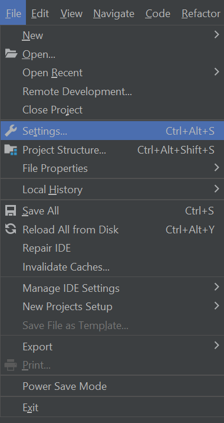
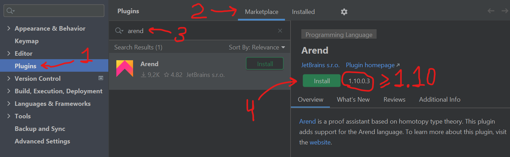
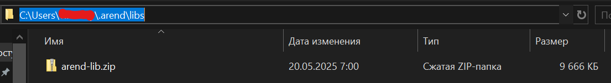
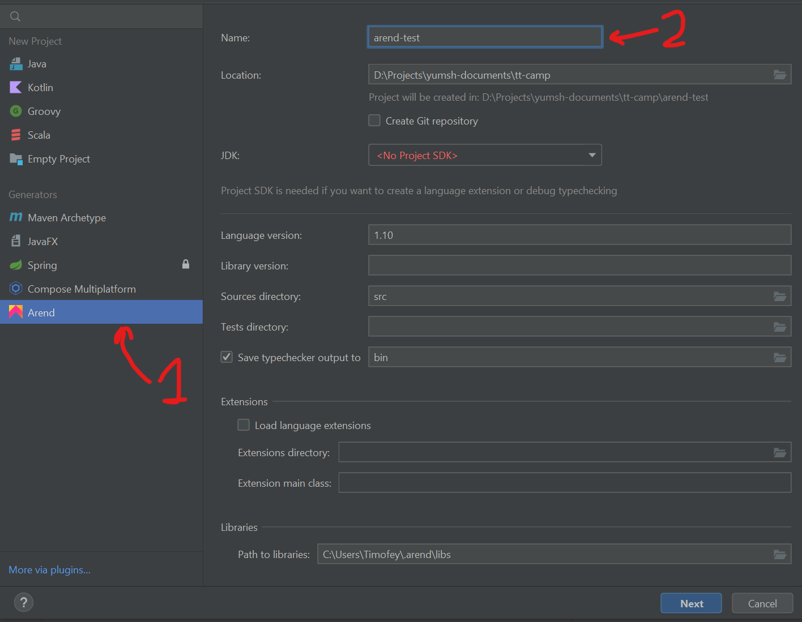
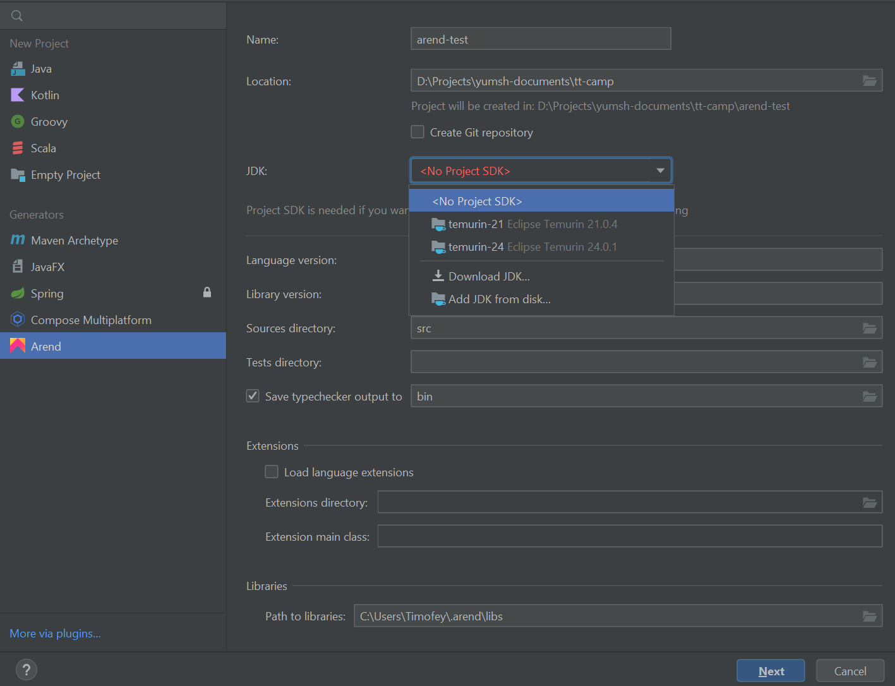
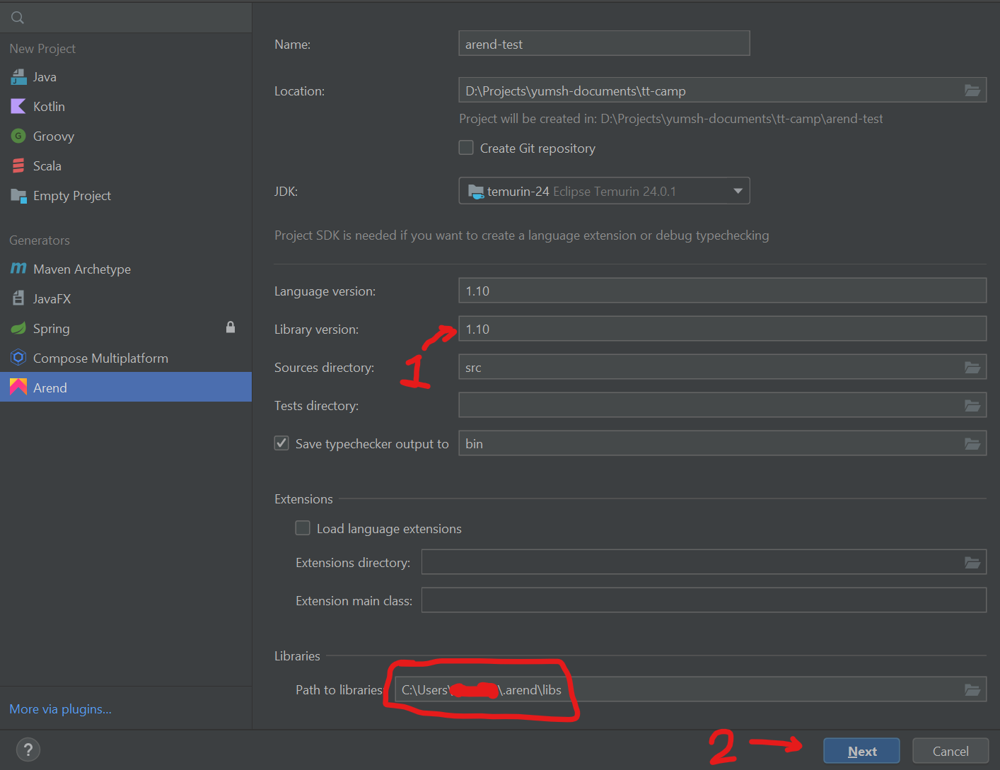
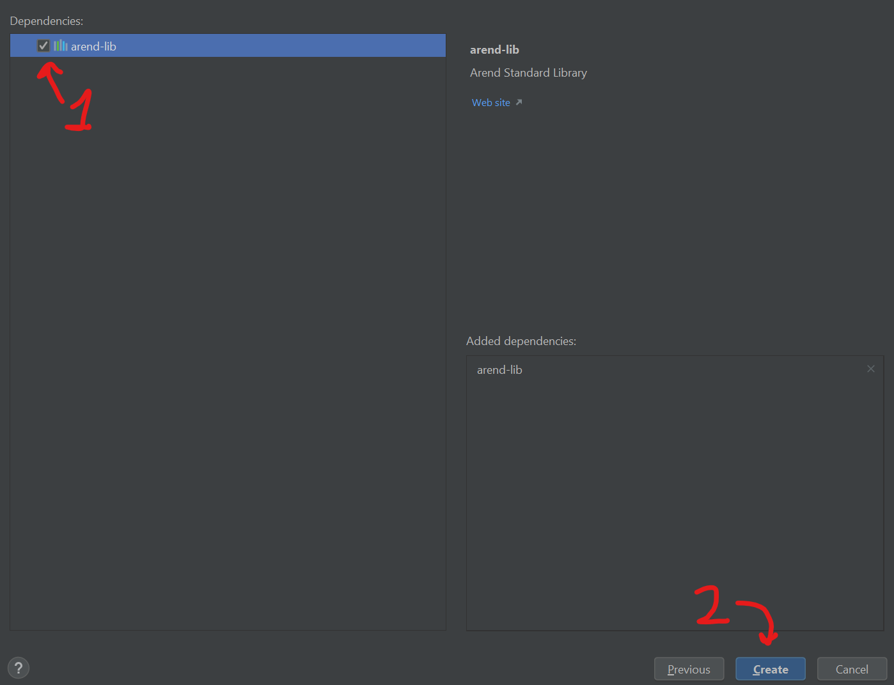

# Установка IntelliJ Arend.

Для работы с Arend, надо скачать три вещи: IntelliJ IDEA, расширение на Arend и стандартную библиотеку. Нет, нельзя без IntelliJ IDEA. Нет, расширение на VSCode не подходит.

## IntelliJ IDEA.

Так сложилось, что расширение для Arend не портировали на актуальную версию IntelliJ IDEA. Поэтому нам нужна более старая.

Нам нужна версия с 2024.1 по 2024.3.6 и **не новее**. Если у Вас другая, скачайте версию 2024.3.6 [отсюда](https://www.jetbrains.com/idea/download/other.html).

## IntelliJ Arend.

Откройте IntelliJ IDEA, откройте *Настройки* в меню *Файл*.

В настройках найдите вкладку *Плагины*, переключите вкладку на *Маркетплейс*, наберите в строке поиска *Arend*, проверьте, что нашлось единственное расширение, и его версия больше ибо равна 1.10, установите его. Если версия меньше, у вас что-то не так с версией IntelliJ IDEA.

<!--https://plugins.jetbrains.com/plugin/11162-arend/versions/stable-->

## Стандартная библиотека.

Скачайте arend-lib [отсюда](https://github.com/JetBrains/arend-lib/releases/download/v1.10.0/arend-lib.zip). Распаковывать его не надо.

Зайдите в домашнюю директорию (`~` в Linux, `%userprofile%` в Windows), создайте там директорию `.arend`, а в ней директорию `libs`. Поместите `arend-lib.zip` в директорию `libs`.

Должно получиться так:

## Создание проекта в IntelliJ IDEA.

Нажмите *Новый проект* во вкладке *Файл*.

Там выберите *Arend*, придумайте ему какое-нибудь название

После этого выберите/скачайте Project SDK. Подойдёт любой JDK версии 11 или выше. Если у Вас такое уже есть, выберите его, иначе выберите вариант "скачать JDK".

Установите версию стандартной библиотеки в 1.10, посмотрите на директорию, которую вам пишут в *Path to libraries* и проверьте, что arend-lib.zip лежит там.

Нажмите *Далее*, в открывшемся окне нажмите галочку около arend-lib и нажмите *Создать*

